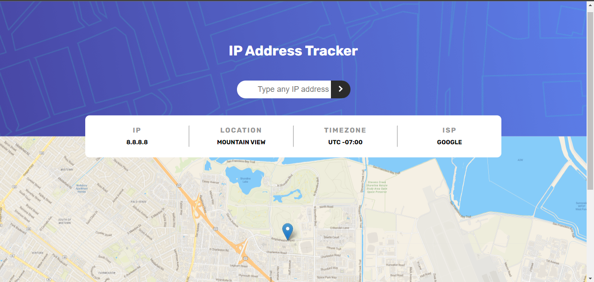
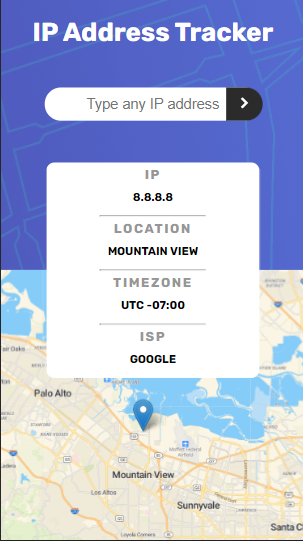

# Frontend Mentor - IP address tracker solution

This is a solution to the [IP address tracker challenge on Frontend Mentor](https://www.frontendmentor.io/challenges/ip-address-tracker-I8-0yYAH0). Frontend Mentor challenges help you improve your coding skills by building realistic projects. 

## Overview

### The challenge

Users should be able to:

- View the optimal layout for each page depending on their device's screen size
- See their own IP address on the map on the initial page load
- Search for any IP addresses and see the key information and location

### Destkop

### Mobile

### Apis used

- Leaflet: https://leafletjs.com/index.html
- MapTiler: https://cloud.maptiler.com/maps/streets/
- Ipapi: https://ipapi.co/

### Extras 

- Snackbar: https://www.polonel.com/snackbar/ creator: https://github.com/polonel

### Stacks 

- HTML
- CSS
- JS (Jquery)

